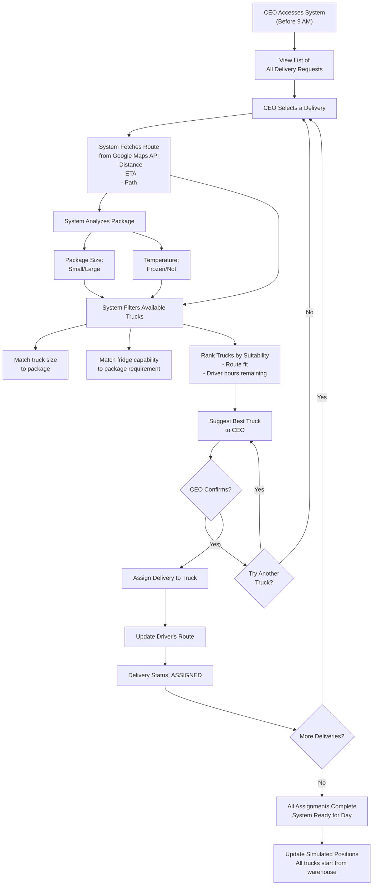
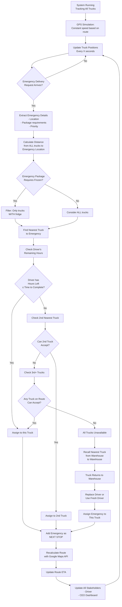
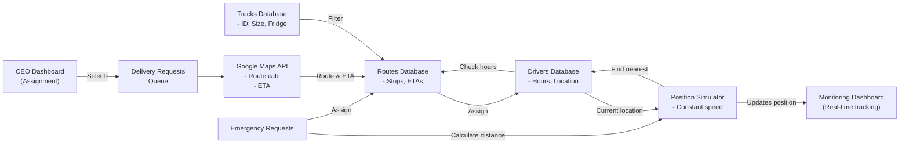

# RLA Delivery Assignment System - Workflow

## Overview
A delivery assignment and real-time emergency management system for a pharmaceutical delivery company.

---

## Phase 1: Morning Assignment (Before 9 AM)

---

## Phase 2: Real-Time Tracking & Emergency Management

---

## Data Flow Architecture

---

## Database Requirements (To Be Designed)

Based on this workflow, you'll need tables for:

1. **Deliveries** - Request details, package specs, status
2. **Trucks** - ID, size, fridge capability, current status
3. **Drivers** - ID, hours worked, current position, assigned truck
4. **Routes** - Delivery stops, ETAs, current progress
5. **EmergencyDeliveries** - Emergency request tracking
6. **RouteSimulation** - Current positions, timestamps (can be in-memory)

---

## Key System Constraints

- ⏰ All assignments must complete **before 9 AM**
- 🚗 Maximum **8 hours** driving per driver per day
- 📍 Position updates use **constant speed simulation** (not real GPS)
- 🔄 Emergency delivery becomes **next immediate stop** (not queued)
- ❌ **One truck per delivery** (no splitting)
- 🧊 **Fridge matching required** for frozen medicines

---

## Next Steps

1. Design the database schema based on these requirements
2. Build the CEO dashboard for morning assignments
3. Implement Google Maps API integration
4. Create the position simulator
5. Build emergency delivery handler
6. Create monitoring dashboard
